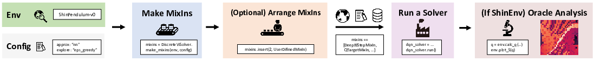
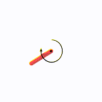
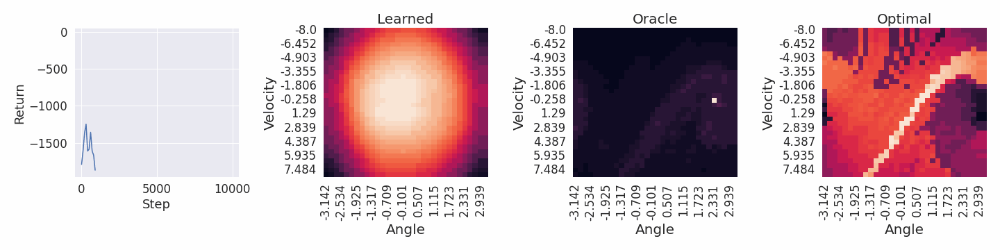
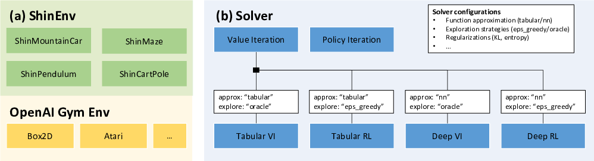
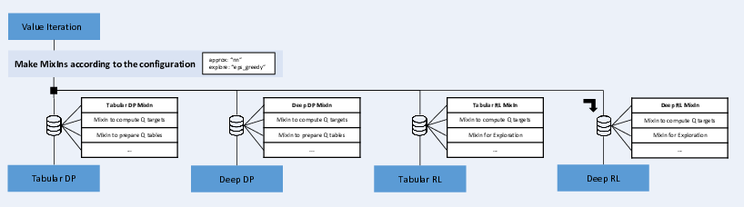

**Status:** Under development (expect bug fixes and huge updates)

# ShinRL: A Library for Evaluating RL Algorithms from Theoretical and Practical Perspectives

ShinRL is an open-source JAX library specialized for the evaluation of reinforcement learning (RL) algorithms **from both theoretical and practical perspectives**.
Please take a look at [the paper](https://arxiv.org/abs/2112.04123) for details.

## QuickStart


Try ShinRL at: [experiments/QuickStart.ipynb](experiments/QuickStart.ipynb).

```python
import gym
from shinrl import DiscreteViSolver
import matplotlib.pyplot as plt

# make an env & a config
env = gym.make("ShinPendulum-v0")
config = DiscreteViSolver.DefaultConfig(explore="eps_greedy", approx="nn", steps_per_epoch=10000)

# make mixins
mixins = DiscreteViSolver.make_mixins(env, config)
# mixins == [DeepRlStepMixIn, QTargetMixIn, BuildTableMixIn, NetActMixIn, BuildNetMixIn, ShinExploreMixIn, ShinEvalMixIn, DiscreteViSolver]

# (optional) arrange mixins
# mixins.insert(2, UserDefinedMixIn)

# make & run a solver
dqn_solver = DiscreteViSolver.factory(env, config, mixins)
dqn_solver.run()

# plot performance
returns = dqn_solver.scalars["Return"]
plt.plot(returns["x"], returns["y"])

# plot learned q-values  (act == 0)
q0 = dqn_solver.data["Q"][:, 0]
env.plot_S(q0, title="Learned")

# plot oracle q-values  (act == 0)
q0 = env.calc_q(dqn_solver.data["EvaluatePolicy"])[:, 0]
env.plot_S(q0, title="Oracle")

# plot optimal q-values  (act == 0)
q0 = env.calc_optimal_q()[:, 0]
env.plot_S(q0, title="Optimal")
```





# :zap: Key Modules



## :microscope: ShinEnv for Oracle Analysis

* `ShinEnv` provides small environments with **oracle** methods that can compute exact quantities.
* Some environments support **continuous action space** and **image observation**:

|                  Environment                  |   Dicrete action   | Continuous action  | Image Observation  | Tuple Observation  |
| :-------------------------------------------: | :----------------: | :----------------: | :----------------: | :----------------: |
|         [ShinMaze](shinrl/envs/Maze)          | :heavy_check_mark: |        :x:         |        :x:         | :heavy_check_mark: |
| [ShinMountainCar-v0](shinrl/envs/mountaincar) | :heavy_check_mark: | :heavy_check_mark: | :heavy_check_mark: | :heavy_check_mark: |
|    [ShinPendulum-v0](shinrl/envs/pendulum)    | :heavy_check_mark: | :heavy_check_mark: | :heavy_check_mark: | :heavy_check_mark: |
|    [ShinCartPole-v0](shinrl/envs/cartpole)    | :heavy_check_mark: | :heavy_check_mark: |        :x:         | :heavy_check_mark: |


## :factory: Flexible Solver by MixIn



* A `Solver` solves an environment with specified algorithms.
* A "mixin" is a class which defines and implements a single feature. ShinRL's solvers are instantiated by mixing some mixins. (See [experiments/QuickStart.ipynb](experiments/QuickStart.ipynb) for details.)

**Example**: How different mixins turn into "value iteration" and "deep Q learning"

```python
import gym
from shinrl import DiscreteViSolver

env = gym.make("ShinPendulum-v0")

# run value iteration (dynamic programming)
config = DiscreteViSolver.DefaultConfig(approx="tabular", explore="oracle")
mixins = DiscreteViSolver.make_mixins(env, config)
# mixins == [TabularDpStepMixIn, QTargetMixIn, BuildTableMixIn, ShinExploreMixIn, ShinEvalMixIn, DiscreteViSolver]
vi_solver = DiscreteViSolver.factory(env, config, mixins)
vi_solver.run()

# run deep Q learning 
config = DiscreteViSolver.DefaultConfig(approx="nn", explore="eps_greedy")
mixins = DiscreteViSolver.make_mixins(env, config)  
# mixins == [DeepRlStepMixIn, QTargetMixIn, BuildTableMixIn, NetActMixIn, BuildNetMixIn, ShinExploreMixIn, ShinEvalMixIn, DiscreteViSolver]
dql_solver = DiscreteViSolver.factory(env, config, mixins)
dql_solver.run()

# ShinRL also provides deep RL solvers with OpenAI Gym environment supports.
env = gym.make("CartPole-v0")
mixins = DiscreteViSolver.make_mixins(env, config)  
# mixins == [DeepRlStepMixIn, QTargetMixIn, TargetMixIn, NetActMixIn, BuildNetMixIn, GymExploreMixIn, GymEvalMixIn, DiscreteViSolver]
dql_solver = DiscreteViSolver.factory(env, config, mixins)
dql_solver.run()
```

# Installation

```bash
git clone git@github.com:omron-sinicx/ShinRL.git
cd ShinRL
pip install -e .
```

# Test

```bash
cd ShinRL
make test
```

# Format

```bash
cd ShinRL
make format
```

# Docker

```bash
cd ShinRL
docker-compose up
```

# Citation

```
# Neurips DRL WS 2021 version
@inproceedings{toshinori2021shinrl,
    author = {Kitamura, Toshinori and Yonetani, Ryo},
    title = {ShinRL: A Library for Evaluating RL Algorithms from Theoretical and Practical Perspectives},
    year = {2021},
    booktitle = {Proceedings of the NeurIPS Deep RL Workshop},
}

# Arxiv version
@article{toshinori2021shinrlArxiv,
    author = {Kitamura, Toshinori and Yonetani, Ryo},
    title = {ShinRL: A Library for Evaluating RL Algorithms from Theoretical and Practical Perspectives},
    year = {2021},
    url = {https://arxiv.org/abs/2112.04123},
    journal={arXiv preprint arXiv:2112.04123},
}
```
