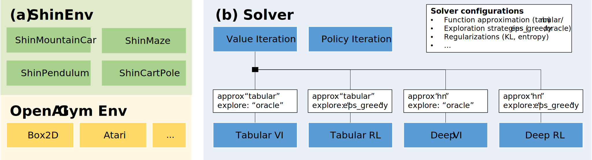

# ShinRL: A Library for Evaluating RL Algorithms from Theoretical and Practical Perspectives



## Requirements

1. Create Conda Environment
```bash
conda create -n shinrl python=3.9 -y
conda activate shinrl
```

2. Install shinrl

```bash
cd ShinRL
pip install -e .[tests]
```

3. Check if shinrl installed successfully

```bash
cd ShinRL
make test
```

4. Optional (Install MinAtar for Case Study 2)

```bash
cd MinAtar
pip install -e .
```

## Reproducing experiments

Open [Reproduction.ipynb](./Reproduction.ipynb) and run the cells.
All the results and pretrained models are stored in the [results](./results) directory.


