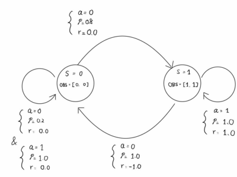

# ShinEnv Tutorial

* 1. [Create Custom ShinEnv](#CreatecustomShinEnv)
	* 1.1. [Create Config](#CreateConfig)
	* 1.2. [Create ShinEnv](#CreateShinEnv)
		* 1.2.1. [env.mdp](#env.mdp)
* 2. [What you can do with ShinEnv](#WhatyoucandowithShinEnv)


Try the following tutorial at: [experiments/ShinEnvTutorial.ipynb](../../experiments/ShinEnvTutorial.ipynb).

##  1. <a name='CreateCustomShinEnv'></a>Create custom ShinEnv


This tutorial demonstrates how to create a custom environment.
We are going to implement the following simple two-state MDP.



You need to implement two classes, 
1. a config class inheriting `shinrl.EnvConfig` and 
2. an env class inheriting `shinrl.ShinEnv`.

###  1.1. <a name='CreateConfig'></a>Create Config

The config class is a dataclass inheriting `shinrl.EnvConfig`.
It holds hyperparameters of the environment.

**Example:**

```python
@chex.dataclass
class ExampleConfig(shinrl.EnvConfig):
    dS: int = 2  # number of states
    dA: int = 2  # number of actions
    discount: float = 0.99  # discount factor
    horizon: int = 3  # environment horizon
```

###  1.2. <a name='CreateShinEnv'></a>Create ShinEnv

The main env class must inherit `shinrl.ShinEnv`.
You need to implement (See details in [/home/rl-dqn/ShinRL-JAX/shinrl/envs/base/env.py](/home/rl-dqn/ShinRL-JAX/shinrl/envs/base/env.py)):

* **DefaultConfig** (ClassVariable): Default configuration of the environment.
* **dS** (property): Number of states.
* **dA** (property): Number of actions.
* **observation_space** (property): Gym observation space.
* **action_space** (property): Gym observation space.
* **init_probs** (function): A function that returns the probabilities of initial states.
* **transition** (function): Transition function of the MDP.
* **reward** (function): Reward function of the MDP.
* **observation** (function): Observation function of the MDP.

For continuous action space envs, you also need to implement:
* **continuous_action** (function): A function that converts a discrete action to a continuous action.
* **discrete_action** (function): A function that converts a continuous action to a discrete action.


**Example:**

```python
class ExampleEnv(shinrl.ShinEnv):
    DefaulatConfig = ExampleConfig
    
    def __init__(self, config=None):
        super().__init__(config)

    @property
    def dS(self) -> int:
        return self.config.dS

    @property
    def dA(self) -> int:
        return self.config.dA

    @property
    def observation_space(self):
        return gym.spaces.Box(low=jnp.array([0, 0]), high=jnp.array([1., 1.]))

    @property
    def action_space(self):
        return gym.spaces.Discrete(self.dA)

    def init_probs(self):
        return jnp.array([1.0, 0.0])

    def transition(self, state, action):
        next_state = jnp.array([0, 1], dtype=int)
        all_probs = jnp.array([[[0.2, 0.8], [1.0, 0.0]], [[1.0, 0.0], [0.0, 1.0]]], dtype=float)
        probs = all_probs[state, action]
        return next_state, probs

    def reward(self, state, action):
        all_rews = jnp.array([[0.0, 0.0], [-1.0, 1.0]], dtype=float)
        rew = all_rews[state, action]
        return rew

    def observation(self, state):
        return jnp.array([state, state], dtype=float)
```

####  1.2.1. <a name='env.mdp'></a>env.mdp

These core functions (transition, reward, etc.) are automatically converted to matrix form and stored in `env.mdp`.

* env.mdp.**dS** (int): Number of states.
* env.mdp.**dA** (int): Number of actions.
* env.mdp.**obs_shape** (Shape): Observation shape.
* env.mdp.**obs_mat** (dS x (obs_shape) Array): Observation of all the states.
* env.mdp.**rew_mat** (dS x dA Array): Reward matrix.
* env.mdp.**tran_mat** ((dSxdA) x dS SparseMat): Tranition matrix.
* env.mdp.**init_probs** (dS Array): Probability of initial states.
* env.mdp.**discount (float): Discount factor.

These matrices are useful for analyzing the behavior (e.g., output of the Q-network) on the full state action space. 

```python
env.mdp.rew_mat  # dS x dA array
```

##  2. <a name='WhatyoucandowithShinEnv'></a>What you can do with ShinEnv

Implemented ShinEnvs can be used like a usual gym.Env:

```python
config = ExampleEnv.DefaulatConfig()
env = ExampleEnv(config)
env.reset()

for _ in range(10):
    act = env.action_space.sample()
    env.step(act)
```

ShinEnv also provides **oracle** methods that can compute exact quantities: 
* `calc_q` computes a Q-value table containing all possible state-action pairs given a policy.
* `calc_optimal_q` computes the optimal Q-value table.
* `calc_visit` calculates state visitation frequency table, for a given policy.
* `calc_return` is a shortcut for computing exact undiscounted returns for a given policy.

```python
key = jax.random.PRNGKey(0)
dS, dA = env.dS, env.dA
policy = jax.random.uniform(key, (dS, dA))
policy = policy / policy.sum(axis=1, keepdims=True)  # dS x dA random policy

env.calc_q(policy)  # dS x dA array
env.calc_optimal_q()  # dS x dA array
env.calc_visit(policy)  # dS x dA array
env.calc_return(policy)  # scalar value
```
